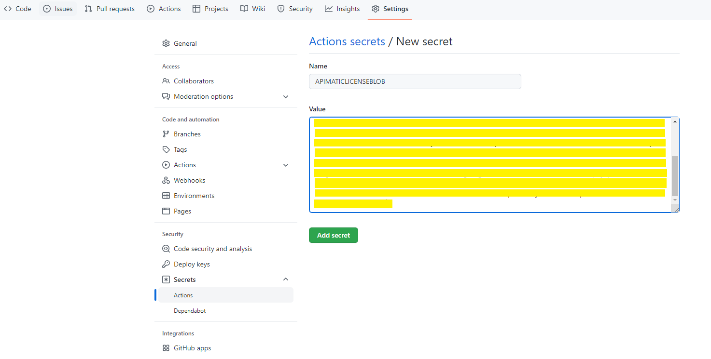
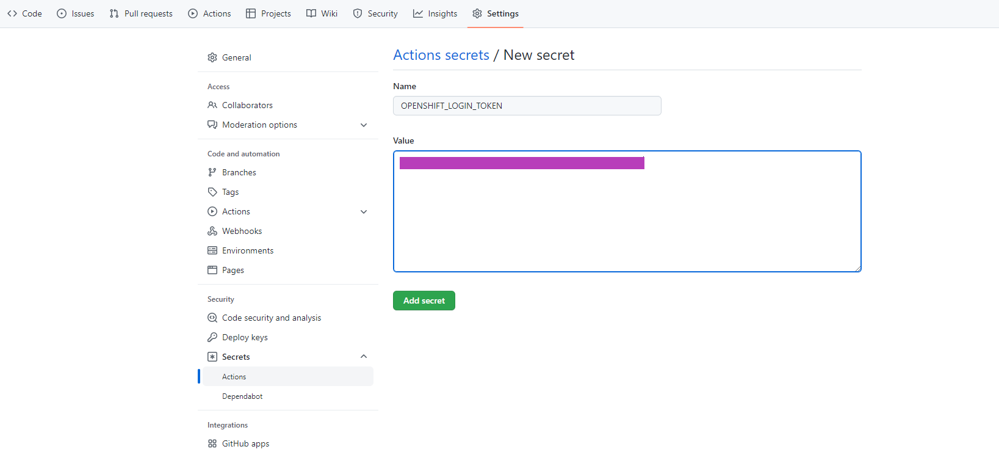
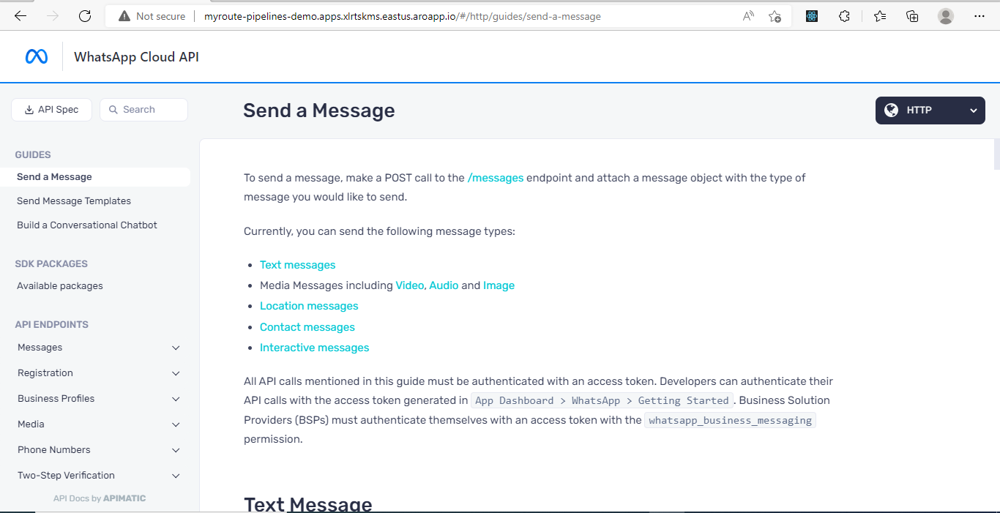

# APIMatic CodeGen OpenShift Pipelines Demo

APIMatic CodeGen is your go-to cloud-ready provider for making the customer on-boarding experience of your APIs a seamless experience. With a flexible set of inputs in the form of an API Portal Build configuration file along with the associated API specification file, logo images and optional custom content, the APIMatic CodeGen app outputs DX Portal artifacts, including SDKs and Docs, that can be deployed in your environment of choice. [OpenShift Pipelines](https://cloud.redhat.com/blog/introducing-openshift-pipelines) is a CI/CD solution for building pipelines using [Tekton](https://tekton.dev).

Following the steps given in this demo, you will see that by using the OpenShift Pipelines operator together with the RedHat-certified [APIMatic CodeGen Operator](https://github.com/apimatic/apimatic-codegen-operator), a complete automation flow can be devised to take your API Portal configurations from source to production-ready DX portal deployment a painless task. You can even use this demo as a starter project to devise your own Source-to-API DX Portal automation flow design without much hassle.

## Project Info

If you would like to know more about how this project is set up and what the different directories and files are for, you can find that information [here](./docs/demo_structure.md). You can view that information later as it is not necessary to understand it to proceed with the demonstration.

Prior knowledge of Tekton and APIMatic CodeGen is not required for this demonstration as all the required configuration are set up in the [GitHub actions](./.github/workflows/). However, you can find more information on these in the following links:

- [Tekton Docs](https://tekton.dev/docs/)

- [APIMatic CodeGen](https://apimatic-core-v3-docs.netlify.app/#/http/getting-started/overview-apimatic-core)

## Prerequisites

You will need an OpenShift 4 cluster to follow the steps given in this demonstration. If you don't have an existing cluster, go to http://try.openshift.com and register for free in order to get an OpenShift 4 cluster up and running on AWS within minutes.

## Demonstration

With your OpenShift 4 cluster setup, we can now proceed with the demonstration using the steps given below:

- **Fork This Repo**

  Fork this repository and add the values for the Repo secrets that will be used to run the initial OpenShift assets set up. These include:

  - **APIMATICLICENSEBLOB**:
    This is the APIMatic CodeGen License string that will be used to start up the APIMatic CodeGen instances.

    

  - **OPENSHIFT_LOGIN_SERVER**:
    This is the value found when you click on the _Copy login command_ as shown below. Copy the values masked by green:

    
    
    
    

  - **OPENSHIFT_LOGIN_TOKEN**:
    This is the token value found when you click on the _Copy Login Command_. Copy the value maked by purple:

    

  - **OPENSHIFT_PROJECT**:
    This is the name of the OpenShift project that will be created in which the Tekton tasks and pipeline resources will be deployed as well as the
    APIMatic CodeGen Server and the DX Portal resources.

    

  Once these are setup, your GitHub Repo secrets page should be as shown below:

  

- **Initial OpenShift Infrastructure Setup**

  With the necessary secret values now configured, you can now manually trigger the [setup_openshift_infrastructure](./.github/workflows/setup_openshift_infrastructure.yaml) GitHub action which will do the following:

  - Install the [oc](https://github.com/openshift/oc) and [tkn](https://github.com/tektoncd/cli) tools to interact with OpenShift clusters and deploy resources as well as trigger Tekton pipelines.

  - Login to your OpenShift cluster with the _oc login_ command using the _OPENSHIFT_LOGIN_SERVER_ and _OPENSHIFT_LOGIN_TOKEN_ GitHub secrets that were set up.

  - Install the RedHat Pipelines and APIMatic CodeGen Operator in _AllNamespaces_ mode using the [operatorassets.yaml](./setup/operatorsassets.yaml) file.

  - Create an OpenShift project using the _OPENSHIFT_PROJECT_ GitHub secret.

  - Update the [codegen.yaml](./setup/codegen.yaml) file, feeding it the _APIMATICLICENSEBLOB_ secret value and use _oc apply_ command to setup a APIMatic CodeGen resource in the created OpenShift project. The APIMatic CodeGen Operator will see this and create the K8s Deployment and Service resources to spin up the APIMatic CodeGen app and have it ready to accept requests for API DX portal artifacts generation.

  - Deploy the Tekton [Tasks and Pipeline](./.tekton/) resources.

  - Trigger the [build-and-deploy](./.tekton/pipeline.yaml) pipeline with the configured parameter values. This will set off a sequence of tasks starting with cloning the GitHub repository contents and finishing off with an initial DX portal web server that is externally accessible using the generated OpenShift route.

  
  
  
  

- **Make Changes and View Results**

  With an initial DX Portal set up, you can now make changes in the contents of the [Portal](./Portal/) directory. Once the changes are pushed into the _main_ branch, the [main.yaml](./.github/workflows/main.yaml) GitHub action will be triggered which will in turn start up the _build-and-deploy_ Tekton pipeline. At the end, you can view the updated DX portal using the route URL as before.

  To demonstrate this, suppose we make the following changes to the [APIMATIC-BUILD.json](./Portal/APIMATIC-BUILD.json) file:

  ```json
  {
    "$schema": "https://titan.apimatic.io/api/build/schema",
    "buildFileVersion": "1",
    "generatePortal": {
      "logoUrl": "/static/images/logo.png",
      "logoLink": "https://www.apimatic.io",
      "debug": {
        "publishReport": true
      },
      "whiteLabel": true,
      "apiSpecs": ["spec1"],
      "languageConfig": {
        "http": {},
        "csharp": {},
        "php": {},
        "python": {},
        "ruby": {}
      },
      "headIncludes": "  <link href=\"https://fonts.googleapis.com/css?family=Open+Sans:300,300i,400,400i,600,600i,700,700i,800,800i&display=swap\" rel=\"stylesheet\">",
      "portalSettings": {
        "themeOverrides": {
          "themeType": "cool",
          "palette": {
            "primaryColor": "#f44336",
            "linkColor": "#6aa84f",
            "colors": {
              "C000": "93c47d",
              "C600": "#3d85c6"
            }
          }
        },
        "enableExport": true
      }
    }
  }
  ```

  The resulting re-generated portal will now have the following look:

  
  

  Admittedly, it's not the best-looking API DX portal in the world but the emphasis was on demonstrating the flexibility APIMatic CodeGen offers in tweaking your DX portal to look just the way you want.

  Since this is a CI/CD pipeline demo after all, feel free to keep making changes in the APIMatic Build file, commit the changes and see how your DX portal appearance alters accordingly.

  You can make these and many more changes by using the [APIMatic CodeGen Build File Reference](https://apimatic-core-v3-docs.netlify.app/#/http/generating-api-portal/build-file-reference).

## Additional Resources

### Documentation

The complete online documentation for all APIMatic offerings is available at:
[https://docs.apimatic.io/](https://docs.apimatic.io/)

## Technical Support

APIMatic [C] provides various sources of technical support.

- Please refer to the [APIMatic contact page](https://www.apimatic.io/contact/) to select a support resource you find suitable for your issue.
- To request additional features in the future, or if you notice any discrepancy regarding this document, please drop an email to [support@apimatic.io](mailto:support@apimatic.io).

### Copyrights

[C] Copyright 2022 APIMatic
